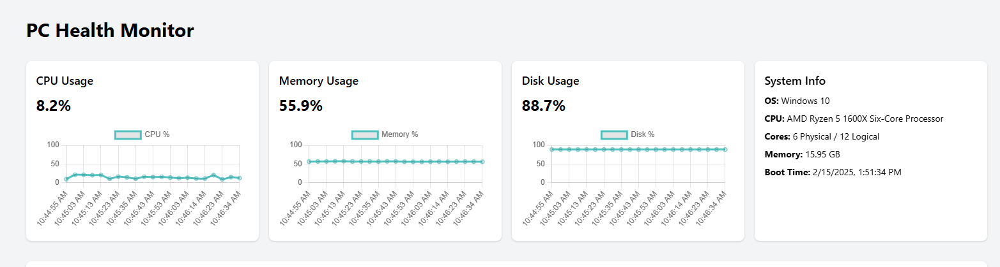
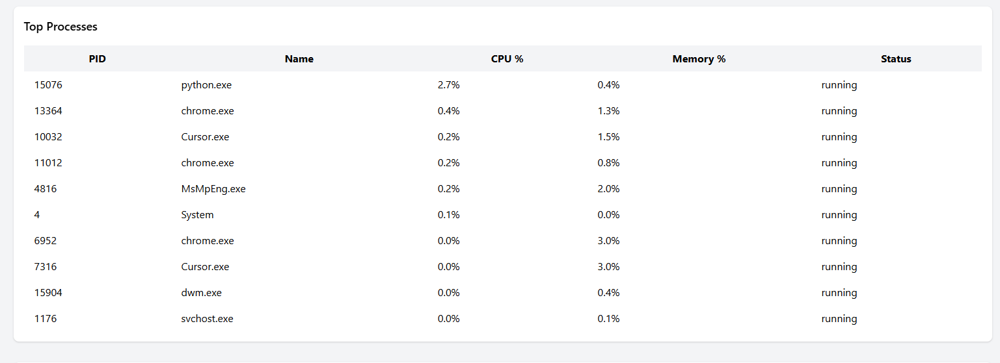
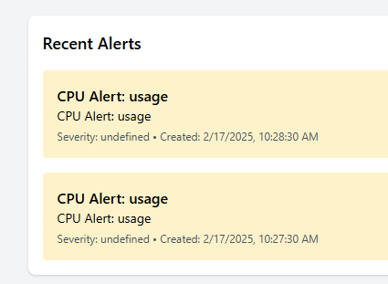

# PC Health Monitor

A comprehensive PC health monitoring solution that leverages SRE best practices to monitor and alert on system health metrics.

## Screenshots

### Dashboard Overview

*The main dashboard showing real-time system metrics including CPU, Memory, and Disk usage.*

### System Metrics

*Detailed view of system metrics with historical trends.*

### Alert Management

*PagerDuty integration showing active alerts and incident management.*

## Features

- Real-time monitoring of critical system metrics:
  - CPU usage and temperature
  - Memory utilization
  - Disk space and I/O
  - Network connectivity
  - Process monitoring
  - Service status checks
- Configurable alert thresholds
- Integration with PagerDuty for incident management
- Ansible-based deployment and configuration
- Extensible architecture for adding custom health checks
- Web dashboard for metric visualization
- Historical data tracking

## Prerequisites

- Python 3.8+
- PagerDuty account (for alerts)
- Git

### Python Dependencies
```
psutil>=5.9.0     # System metrics
pdpyras>=4.5.1    # PagerDuty integration
fastapi>=0.104.0  # API server
uvicorn>=0.24.0   # ASGI server
pyyaml>=6.0.1     # Configuration
SQLAlchemy>=2.0.23  # Database ORM
prometheus-client>=0.19.0  # Metrics
```

## Installation

### Quick Start (Manual Installation)

1. Clone the repository:
```bash
git clone https://github.com/yourusername/PC-Health.git
cd PC-Health
```

2. Install dependencies:
```bash
pip install -r requirements.txt
```

3. Configure your settings:
```bash
cp config/config.example.yaml config/config.yaml
# Edit config.yaml with your PagerDuty API key and preferred thresholds
```

4. Run the monitoring service:
```bash
python src/monitor.py
```

### Automated Deployment (Using Ansible)

1. Install Ansible:
```bash
pip install ansible
```

2. Create an inventory file (hosts.yml):
```yaml
all:
  hosts:
    your_machine:
      ansible_host: your_ip
      ansible_user: your_username
```

3. Run the Ansible playbook:
```bash
ansible-playbook -i hosts.yml ansible/deploy.yml
```

This will:
- Install all dependencies
- Set up the service as a systemd unit
- Configure automatic startup
- Set proper permissions and directories

## Project Structure

```
PC-Health/
├── ansible/                 # Ansible deployment files
│   ├── deploy.yml          # Main deployment playbook
│   └── templates/          # Service templates
├── config/                 # Configuration files
│   ├── config.yaml        # Your configuration
│   └── config.example.yaml # Example configuration
├── src/                    # Source code
│   ├── collectors/        # Metric collection modules
│   ├── alerting/         # Alert management
│   ├── api/              # API endpoints
│   └── dashboard/        # Web dashboard
├── docs/                  # Documentation
│   └── images/           # Screenshots and images
├── tests/                 # Test suite
└── requirements.txt       # Python dependencies
```

## Configuration

The monitoring thresholds and alert settings can be configured in `config/config.yaml`. Example configuration:

```yaml
metrics:
  cpu:
    warning_threshold: 80
    critical_threshold: 90
  memory:
    warning_threshold: 85
    critical_threshold: 95
  disk:
    warning_threshold: 90
    critical_threshold: 95

pagerduty:
  api_key: YOUR_API_KEY
  service_id: YOUR_SERVICE_ID

dashboard:
  enabled: true
  host: "127.0.0.1"
  port: 8000
```

## Development

For development work:
```bash
# Install development dependencies
pip install -r requirements.txt

# Run tests
pytest

# Format code
black .

# Lint code
pylint src/
```

## Contributing

1. Fork the repository
2. Create a feature branch
3. Submit a pull request

## License

This project is licensed under the MIT License - see the LICENSE file for details.

## Acknowledgments

- PagerDuty API
- psutil library
- FastAPI framework
- Ansible community
 
